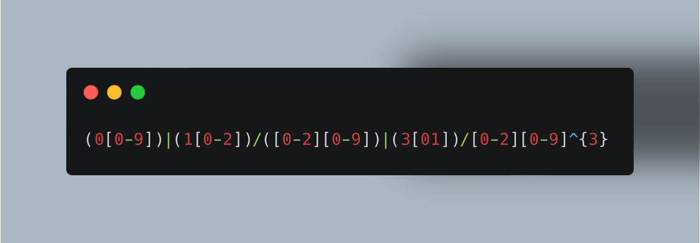

# REX: A Declarative Regular Expression Language

Authors:

Tai Danh: [@taidanh](https://github.com/taidanh)

Eric Hernandez: [eric-hdez](https://github.com/eric-hdez)

## Overview

For our final project, we decided to build **REX**: a declarative regular expression language, with SQL-like syntax. The language supports the basic regular expression operators *union* (|), *concatenation* (.), and *star repeat* (\*). The project will go public very soon!

## Downsides of Regex

One of the main downsides of traditional regular expressions is that they can be difficult to read, write, and understand, especially for newcomers or someone who is working on multi-layered patterns. Traditional regular expression syntax is often dense and opaque, which can make it difficult to write and maintain regular expressions. This difficulty increases when there are more hands on a project and they are trying to understand and modify regular expressions written by others.

Another downside of traditional regular expressions is that they are not very modular or reusable. In many cases, regular expressions are written as long, monolithic strings that are difficult to break up into smaller, more manageable pieces. This can make it difficult to reuse regular expressions, or to modify regular expressions without breaking existing code.

## Ideal Use Case

The ideal use case for REX is when developers need to write complex, flexible, and maintainable regular expressions that can be easily reused and understood by others. REX is designed to make it easy for developers to create regular expressions that are modular, readable, and intuitive, while also providing powerful features such as variables and composite operators that enable developers to write more expressive and flexible patterns.

One of the key goals of REX is to make regular expression writing more intuitive and accessible, particularly for developers who are new to the field or who may find traditional regular expression syntax difficult to understand. By using a syntax that is similar to declarative programming languages, REX allows developers to focus on what they want to match, rather than how to match it. This keeps one of our core missions in mind to makes it easier to write, understand, and modify regular expressions.

Another important goal of REX is to enable developers to write more reusable and maintainable regular expressions. Through the use of variables and composite operators, REX allows developers to create modular, self-contained patterns that can be easily shared and reused across different parts of a regular expression. This makes it easier to update and modify regular expressions, as well as making the code more readable and maintainable.

## Motivation

The idea for our project came after one of the early CSE 211 lectures that discussed parsers and parser generators. In the lecture, we discussed regular expressions, the syntax of regular expressions, and parsing with derivatives. As we discussed the lecture after class, we noted the difficulty of parsing very large and intricate regular expression patterns with the naked eye. We thought of SQL, which at times can almost feel like you are speaking a natural language, and we thought about bringing that aspect to a declarative regular expression language. This could help ease the difficulty of mentally parsing intricate regular expression patterns.

REX takes some inspiration from Melody, a language that compiles ECMA Script regular expressions, while aiming to be more readable and maintainable. We found melody a while back during our third year of university, and our idea reminded us about this regular expression language.

## Set Up

From the beginning, we decided to build the entirety of REX using the Rust Programming Language. We chose Rust for the commodity of safety that it brings to memory management and the speed. You also can't forget the commodity of a crate being somewhere out there for just about anything you can think of.

## Front End

The front end is written in a parser generator called LALRPOP. Antlr4 was actually our inital choice, but we ran into too many issues. Thankfully transistioning the grammar to LALRPOP was easy becuase it's also interfaced with a BNF. Also, being written in rust it has first class support for rust programs and took very little work to get something running. To view the grammar definition refer to `src/rex.lalrpop`, the intuitive and concise BNF for LALRPOP allows the grammar to be very readable. It consists of a series of rules that specify how the language's various constructs, such as expressions and terms, can be combined to form valid regular expressions. The grammar also defines how these constructs should be translated into the abstract syntax tree representation used by the REX compiler. This is an essential component of the language that enables the compiler to generate the AST representation of a regular expression, which can then be processed and executed by the REX runtime.

## Back End

The back end of REX makes use of the AST generated by the front end to create an in-place state machine that processes the string we look to match. As the program eats one character at a time, the state machine moves from state to state on the AST and checks to see if the character matches. The match is evaluated by taking the intersection of the singelton set made up of our currently processed character and the set of acceptable characters at the current state. If the intersection is empty, then there is no valid match at that state, and the character is rejected. If the intersection is non-empty, then we may move onto the next state and process the next character of the string to match.

## Usage




Compile the binary:
```bash
cargo build
```

Run the Binary:
```bash
./target/debug/rex
```

Options:
```
--rex -r Provide a file containing REX code or a string of rex code
  [INPUT] This can be a file or a string that REX will match
```

## Future Features
- 'to' for character ranges
- 'by' for repeating by a specified amount
- move from our current state machine to a pushdown automaton
- continue working on it and expanding it :)

